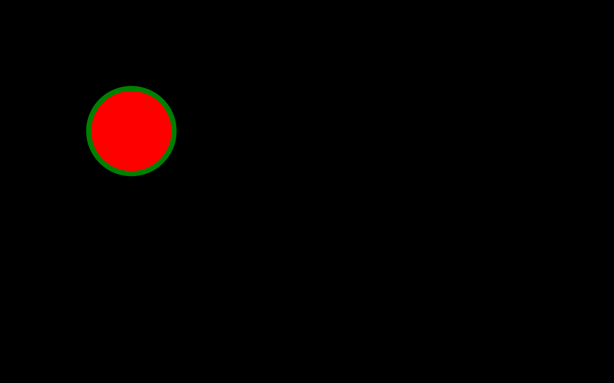
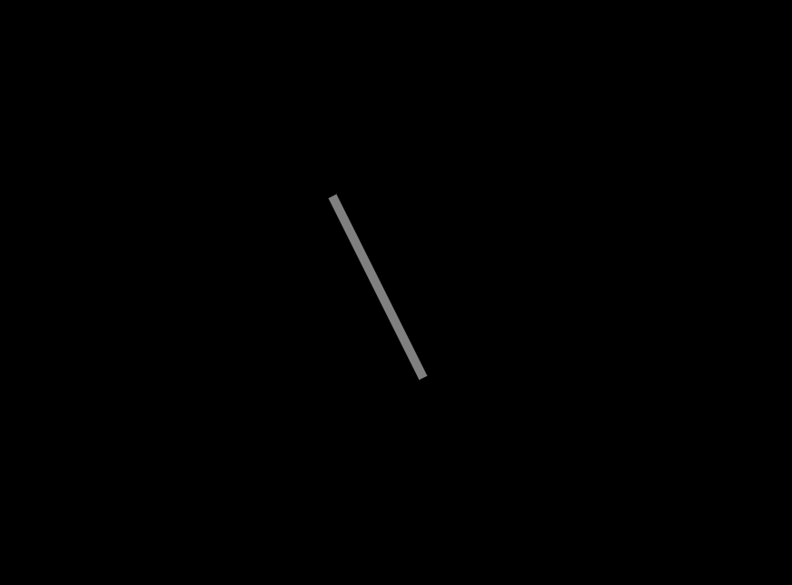
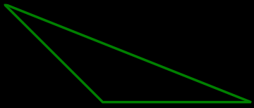
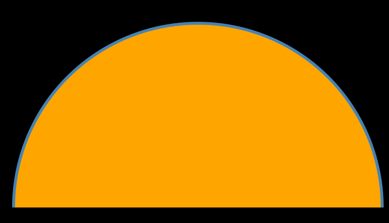
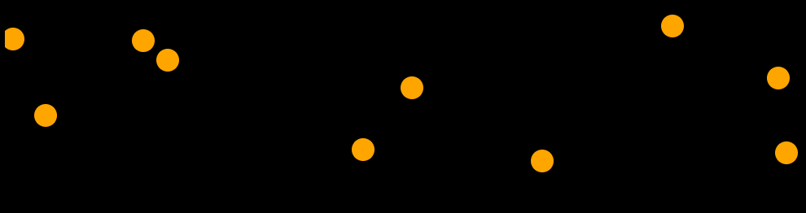
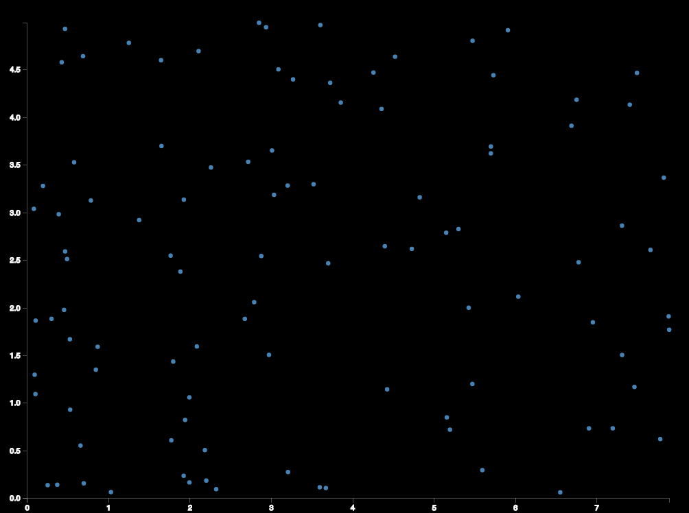
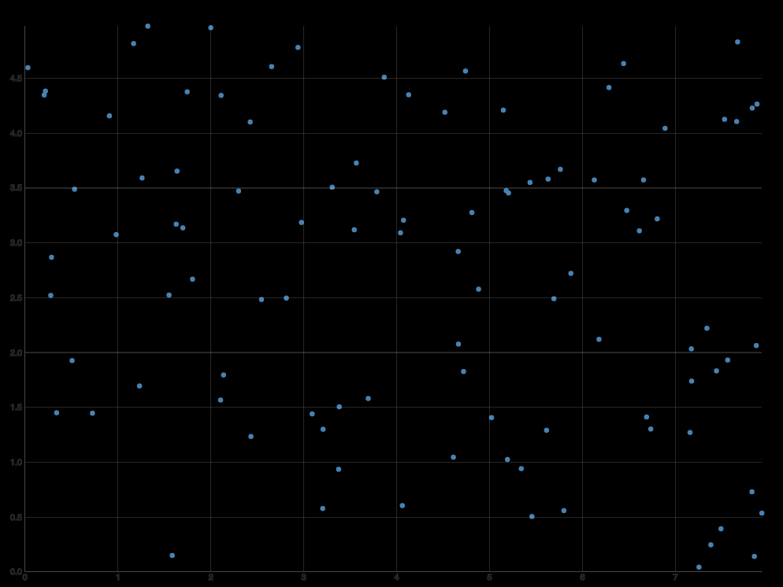
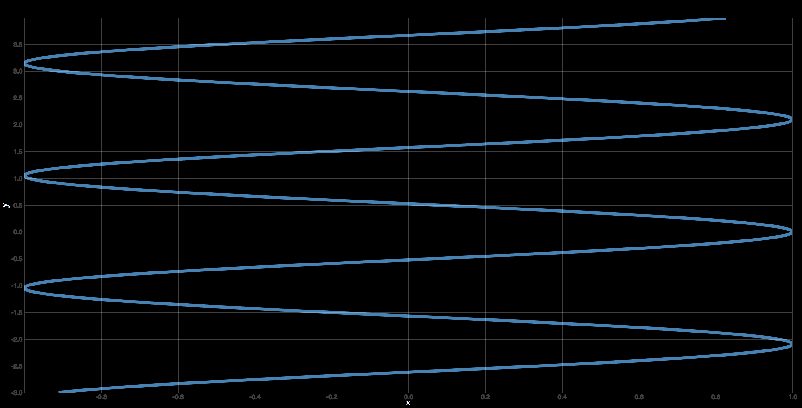

autoscale:true
slidenumbers:true
footer: nthompson@bandgap.io
theme: franziska,8

# Intro to [D3.js](https://d3js.org/)

## (with a [plotly.js](https://plot.ly/) detour)

---

# What is D3?

- D3 is a javascript library for generating scalable vector graphics (SVG).
- It also has a custom DOM API which some people like.

---

## Why do I need a library to generate SVG?

Because SVG specifies pixel locations! It's painful to create graphics this way.

D3.js helps convert your data to reasonable pixel locations.

---

## If you don't understand SVG, you won't understand D3

And you certainly won't be able to debug your D3 code.

Not knowing SVG makes your life miserable when using d3.js.

---

## d3: Not an abstraction layer

d3 is a code generation layer.

If you want abstraction from SVG, expect to be frustrated.

---

## SVG basics: Create a circle

```html
<svg width="600" height="600">
  <circle cx="300" cy="300" r="50" fill="red"></circle>
</svg>
```

---



---

## SVG Basics: Create a line

```html
<svg width="600" height="600">
<line x1="200" y1="250" x2="250" y2="350" stroke="gray" stroke-width="5"></line>
</svg>
```

---



---

## SVG primitives

```html
<svg width="600" height="400">
  <rect x="50" y="50" width="60" height="40" fill="green"></rect>
  <circle cx="0" cy="0" r="50" fill="red"></circle>
  <ellipse cx="120" cy="120" rx="35" ry="20" fill="steelblue"></ellipse>
  <line x1="200" y1="250" x2="250" y2="350" stroke="gray" stroke-width="5"></line>
  <polygon fill="green" stroke="blue" stroke-width="4"
       points="40,45
               150,50
               220,200"></polygon>
  <text x="250" y="25" font-family="times" font-size="25"
        fill="gray">This is text!</text>
</svg>
```

This is getting tedious fast!

---

## SVG polygon

```html
<svg width="200" height="250">
  <polygon
  points="50 160, 55 180, 70 180, 60 190, 65 205, 50 195, 35 205, 40 190, 30 180, 45 180"
  stroke="green" fill="transparent" stroke-width="5"/>
</svg>
```

The $$(x, y)$$ coordinates are given as `"x1 y1, x2 y2, ..."`

---

## SVG path

```html
<svg width="800" height="600">
  <!-- M: Moveto, L: Lineto, Z: Close the path -->
  <path d="M0 0 L200 200 L500 200 Z"
        stroke="green"
        stroke-width="5"></path>
</svg>
```

---



(Note: I had to screenshot the svg to get a png to get it into deckset, which is why this is pixelated.)

---

## SVG Gotcha:

The $$y$$-coordinate increases *downwards*.

This makes sense, because it is ambiguous where the bottom of an html page is.

So $$y = 0$$ is the top of the `<svg>`.

---

## SVG text

```html
<text x="10" y="10">Hello World!</text>
```

---

## SVG Clip paths

These compute set intersections. This computes the set intersection of a circle with a rectangle.

```html
<svg width="800" height="600" >
  <defs>
    <clipPath id="rectangleClipper">
      <rect x="0" y="0" width="400" height="300" />
    </clipPath>
  </defs>
  <circle cx="200" cy="300" r="190"
          clip-path="url(#rectangleClipper)"
          stroke="steelblue" stroke-width="3px" fill="orange">
  </circle>
</svg>
```

---



---

## SVG Groups

```html
<svg width="100" height="100">
    <g transform="scale(2)">
        <rect width="50" height="50" />
    </g>
</svg>
```

SVG groups apply at transform to all their children.

This makes it easier to reason about where a group of related geometric primitives will place.

This creates a square half the size of the SVG element, then the group scales it to twice the size.

---

## SVG supports Javascript events

```html
<svg width="600" height="400">
  <circle id="circ" cx="100" cy="100" r="50" fill="steelblue"
          onclick="clickfunc()"
          onmouseover="mouseoverfunc()"
          onmouseout="mouseoutfunc()"></circle>
</svg>
```

```javascript
const clickfunc = () => {
  document.getElementById("circ").style.fill = "green";
};
const mouseoverfunc = () => {
  document.getElementById("circ").style.fill = "orange";
};
const mouseoutfunc = () => {
  document.getElementById("circ").style.fill = "steelblue";
};
```

---

## Additional SVG CSS attributes:

- `stroke`
- `stroke-width`
- `opacity`
- `fill`

```html
<circle cx="105" cy="25" r="20" fill="yellow" stroke="red" stroke-width="5"
        opacity="0.4"></circle>
```

These are not legal CSS attributes to style HTML.

---

# SVG references

We only need to know a little SVG to be successful with d3.
But of course we can be better if we know more.
A popular reference is [SVG Animations](https://www.amazon.com/SVG-Animations-Implementations-Responsive-Animation/dp/1491939702)

---

# d3 at a glance

- d3 is for programming; you can do a lot.
- Learning curve is large.
- BSD licenced, so you can use it without worry.


---

## d3.js helps us build SVG images

Let's build this SVG image with d3.js:

```html
<svg width="600" height="400">
  <rect x="50" y="50" width="60" height="40" fill="green"></rect>
</svg>
```

---

```html
<!DOCTYPE html>
<html>
<head>
<meta charset="utf-8">
<script src="d3.v4.min.js"></script>
</head>
<body>
<svg width="600" height="400"><svg>
<script>
const svg = d3.select("svg");
svg.append("rect").attr("x", 50).attr("y", 50)
   .attr("width", 60).attr("height", 100);
</script>
</body>
</html>
```

(Aside: Note that `const` in javascript only makes the bound pointer immutable; you can still change the subobjects.)

---

## Events with d3.js


```javascript
const svg = d3.select("svg");
svg.append("rect").attr("x", 50).attr("y", 50)
   .attr("width", 60).attr("height", 100)
   .attr("fill", "orange")
   .on("mouseover", () => {
     console.log(this);
      d3.select(this).style("fill", "steelblue");})
   .on("mouseout", function() { d3.select(this).style("fill", "orange");})
   .on("click", function() { d3.select(this).style("fill", "red"); });
```

Note that if we replace the event functions with arrow functions, the code will not work, as arrow functions as `this` has different meaning in arrow vs. traditional JS functions.


---

## d3.js gotchas

- d3 uses the SVG coordinate system, so the y-axis increases *downwards*.

---

## d3 has given us a new DOM API:

```javascript
d3.select("body").append("p").text("Hello from D3!");
```

which is equivalent to what we learned

```javascript
const pnode = document.createElement("p");
const tnode = document.createTextNode("Hello from the DOM API!");
pnode.appendChild(tnode);
document.body.appendChild(pnode);
```

Ok maybe d3 is better than the DOM API . . .

---

## d3 `enter()` function

If there is more data than elements selected, create them.

```javascript
const dataset = [0, 5, 10, 15, 20];

d3.select("body").selectAll("p").data(dataset).enter().append("p").text("Hola!");
```

The data can be accessed via the `__data__` attribute of the node:

```javascript
> document.body.getElementsByTagName("p")[0].__data__);
0
> document.body.getElementsByTagName("p")[1].__data__);
5
```

---

## d3 scatterplot

```javascript
const svg = d3.select('svg');
// (x,y) pairs:
const dataset = [
                [5, 20], [480, 90], [250, 50], [100, 33], [330, 95],
                [410, 12], [475, 44], [25, 67], [85, 21], [220, 88]
              ];
svg.selectAll("circle") // There are no circles, so this is an empty selection
   .data(dataset) // bind data to the selection
   .enter() // use enter() to identify the mismatch between bound data and selection
   .append("circle")
   .attr("cx", d => d[0])
   .attr("cy", d => d[1])
   .attr("r", 7)
   .attr("fill", "orange");
```

---



---


## d3: map data to pixels

- Thus far, we have placed svg primitives in pixel locations.
- Real data does not have pleasant pixel locations
- We need transforms to map dataspace to pixelspace

---

## d3: map data to pixels

```javascript
> const scale = d3.scaleLinear().domain([20, 50]).range([-1,1]);
> scale(22);
-0.8666666666666667
```

---

## d3: creating scales

```javascript
const width = 600; // SVG will be 600px wide
const dataset = [10, 3, 8, 19];
const max = d3.max(dataset);
const min = d3.min(dataset);
const scale = d3.scaleLinear().domain([min, max]).range([0, width]);
```

We should probably start using JS standard `Math.max(...dataset)` (it's native code) rather than D3 utilities for finding the max . . .

---

## d3: scale x and y

```javascript
const width = 600;
const height = 400;
const dataset = [
                [5, 20], [480, 90], [250, 50], [100, 33], [330, 95],
                [410, 12], [475, 44], [25, 67], [85, 21], [220, 88]
              ];
const x_max = d3.max(dataset, d => d[0]);
const x_min = d3.min(dataset, d => d[0]);
const y_max = d3.max(dataset, d => d[1]);
const y_min = d3.min(dataset, d => d[1]);

const xScale = d3.scaleLinear().domain([x_min, x_max]).range([0, width]);
const yScale = d3.scaleLinear().domain([y_min, y_max]).range([height, 0]);
```

Note the weird range of the y-scale; this is from the SVG coordinate system.

---

## d3: Creating graphs

```javascript
const width=600;
const height=400;
const svg = d3.select("svg").attr("width", width).attr("height", height);
const g = svg.append("g");
const dataset = [ [-2, 4], [-1, 1], [ 0, 0], [ 1, 1], [ 2, 4] ];
// d3.extent combines d3.min/d3.max
const xExtents = d3.extent(dataset, d => d[0]);
const yExtents = d3.extent(dataset, d => d[1]);
const xScale = d3.scaleLinear().domain(xExtents).range([0, width]);
const yScale = d3.scaleLinear().domain(yExtents).range([height, 0]);
const line = d3.line().curve(d3.curveMonotoneX)
               .x(d => xScale(d[0]))
               .y(d => yScale(d[1]));
g.append("path").datum(dataset).attr("stroke", "steelblue").attr("d", line);
```

---

## d3: Axes

```javascript
const g = svg.append("g").attr("transform", `translate(${margin.left}, ${margin.top})`);
const xAxis = d3.axisBottom(xScale).ticks(8);
const yAxis = d3.axisLeft(yScale).ticks(10);
g.append("g")
   .attr("class", "axis")
   .attr("transform", `translate(0, ${height})`)
   .call(xAxis);
```

See `d3/axes.html`.

---



---

## d3: Gridlines

Gridlines can be constructed by making the ticks the size of the whole `<g>` element.

```javascript
const xAxis = d3.axisBottom(xScale).ticks(8).tickSize(-height).tickSizeOuter(0);
const yAxis = d3.axisLeft(yScale).ticks(10).tickSize(-width).tickSizeOuter(0);
```

Make sure to set the opacity to (say) 0.15:

```javascript
g.append("g")
   .attr("class", "axis")
   .attr("transform", `translate(0, 0)`)
   .attr("opacity", 0.15)
   .call(yAxis);
```

---



---

## d3: Custom axis labels

```javascript
var xAxis = d3.axisBottom(xscale)
              .tickValues([-2, -1, 1, 3])
              .tickFormat( (d) => {
                switch(d) {
                    case -2:
                      return "L1";
                    case -1:
                      return "L2";
                    case 1:
                      return "L3";
                    case 3:
                      return "L4";
                    default:
                      throw "Bad value for tick label";
                }
              });
```

---

## d3: transitions

Transitions change the state of an SVG via a continuous transformations.

```javascript
d3.selectAll("circle").data(dataset).enter()
  .append("circle")
  .attr("cx", d => xScale(d[0]))
  .attr("cy", d => yScale(d[1]))
  .attr("r", 10)
  .attr("fill", "steelblue")
  .on("click", function(d) {
    d3.select(this).transition()
      .attr("r", 20).attr("fill", "orange").duration(500);
  });
```

See `d3/transitions.html`.


---

## d3: brush

- Brushes select an area of a graph and zoom to it.

- See Mike Bostock's [example](https://bl.ocks.org/mbostock/f48fcdb929a620ed97877e4678ab15e6) use of the D3 brush.

- Brushes will be our first our of `clipPath`s, since during a zoom, data exists that is outside the zoom region.

---

## d3: brush
```javascript
const brush = d3.brush().on("end", brushended).extent([[0,0], [width, height]]);
g.append("g").attr("id", "brush").call(brush);
let idleTimeout = null;
function brushended() {
    const s = d3.event.selection;
    if (!s) {
        if (!idleTimeout) return idleTimeout = setTimeout(() => { idleTimeout = null; }, 350);

        xScale.domain([xmin, xmax]); yScale.domain([ymin, ymax]);
    }
    else {
        // xScale.invert: takes a pixel location an maps it to a data location.
        const newxextent = [xScale.invert(s[0][0]), xScale.invert(s[1][0])];
        xScale.domain(newxextent);
        const newyextent = [yScale.invert(s[1][1]), yScale.invert(s[0][1])];
        yScale.domain(newyextent);
        svg.select("#brush").call(brush.move);
    }
    const trans = svg.transition().duration(750);
    svg.select("#axis--x").transition(trans).call(xAxis);
    svg.select("#axis--y").transition(trans).call(yAxis);
    svg.selectAll(".line").transition(trans).attr("d", line);
};
```

See `d3/brushgraph.html`.

---

# d3: Clip paths for brush zoom

```javascript
g.append("defs").append("clipPath").attr("id", "rectangleClipper")
 .append("rect").attr("x", 0).attr("y", 0)
 .attr("width", width).attr("height", height);

g.selectAll("path").data(dataset).enter()
 .append("path").attr("class", "line")
 .attr("clip-path", "url(#rectangleClipper)")
 .attr("d", line);
```

If we don't have a clip path for the lines, the lines leave the group domain!

---


# d3: references

- [D3.js in Action](https://www.amazon.com/D3-js-Action-Data-visualization-JavaScript/dp/1617294489/)

- [Interactive Data Visualization for the Web](https://www.amazon.com/Interactive-Data-Visualization-Web-Introduction/dp/1491921285/)

- [D3 Tips and Tricks v4.x](https://leanpub.com/d3-t-and-t-v4) (Free!)

- [Expert Data Visualization](https://www.packtpub.com/web-development/expert-data-visualization)

---

## d3: Swap x and y to get vertical graphs

```javascript
const line = d3.line().curve(d3.curveMonotoneX)
             .x( d => yScale(d) )
             .y( (d, i) => xScale(xmin + i*spacing) );
```

---



---

## d3: Using FileSaver.js to downloading SVG files

```javascript
const serializer = new XMLSerializer();
const svg = document.getElementsByTagName('svg')[0];
const svgString = serializer.serializeToString(svg);
const blob = new Blob([svgString], {type: "image/svg+xml;charset=utf-8"});
// FileSaver.js function:
saveAs(blob, 'lissajous.svg');
```

See `download_svg.html` for details.

Note how the CSS doesn't show up on the downloaded image.

There are ways around this (traversing the tree and `getComputedStyle`), but we won't go there.

---

## plotly.js

  - [plotly.js](https://plot.ly/javascript/) is a MIT-licensed framework for creating beautiful scientific graphs.

  - Even though plotly is open-source ([github repo](https://github.com/plotly/plotly.js)), they do have a business model and they will try to monetize you.

  - This can be annoying, but nonetheless open-source + business model is a good foundation to build your own products on. (Less chance of death with revenue, if death, contributors can keep the code surviving.)


---

## Plotly: Alternatives to plotly.js

  - Although plotly gives (IMO) a good productivity/flexibility tradeoff, your can move down the stack to D3.js (BSD license) for more flexibility, and to highcharts for better productivity (commercial)

---

## Plotly: First plotly plot

```html
<!DOCTYPE html>
<html>
<head>
<script src="https://cdn.plot.ly/plotly-latest.js"></script>
</head>
<body>
<div "plotly-output"></div>
<script>
var lineplot = { x: [1, 2, 3, 4], y: [1, 2, 3, 4], type: 'scatter'};
Plotly.newPlot('plotly-output', [lineplot]);
</script>
</body>
</html>
```

Open `example01.html` to see the output.

---

## Plotly: Two graphs in a plot

```javascript
var graph1 = { x: [1, 2, 3, 4], y: [1, 2, 3, 4], type: 'scatter'};
var graph2 = { x: [1, 2, 3, 4], y: [2, 4, 6, 8], type: 'scatter'};
Plotly.newPlot('plotly-output', [graph1, graph2]);
```

See `example02.html` for working code.

---

## Plotly: No lines connecting points

```javascript
var graph = { x: [1, 2, 3, 4], y: [1, 2, 3, 4], mode: 'markers'};
Plotly.newPlot('plotly-output', [graph]);
```

See `example03.html`.

---

## Plotly: Lines and no markers

```javascript
var graph = { x: [1, 2, 3, 4], y: [1, 2, 3, 4], mode: 'lines'};
Plotly.newPlot('plotly-output', [graph]);
```

The points are interpolated linearly; see `example04.html`.

---

## Plotly: Spline interpolation

```javascript
var graph = { x: [1, 2, 3, 4],
              y: [1, 2, 3, 4],
              mode: 'lines',
              line: {shape: 'spline'},
            };
Plotly.newPlot('plotly-output', [graph]);
```

---

## Plotly: Titles and Axis labels


```javascript
var graph = { x: [1, 2, 3, 4],
              y: [1, 2, 3, 4],
              mode: 'lines',
              line: {shape: 'spline'},
            };
var layout = {
    title: 'Bandstructure of Na',
    xaxis: {
      title: 'k',
    },
    yaxis: {
      title: 'E (eV)',
    }
};
Plotly.newPlot('plotly-output', [graph], layout);
```

See `example06.html`.

---

## Plotly: Naming traces (example07.html)

```javascript
var graph0 = { x: [-2, -1, 0, 1, 2], y: [4, 1, 0, 1, 4],
              mode: 'lines',
              line: {shape: 'spline',
                     color: 'rgba(67,67,67,1)'},
              name: 'Valence band'
             };
```

---

## Plotly: Staring at a lightbulb is no fun.

Let's change the background color (example08.html):

```javascript
var layout = {
    title: 'Bandstructure of Na',
    xaxis: {
      title: 'k',
    },
    yaxis: {
      title: 'E (eV)',
    }
    plot_bgcolor: '#c7c7c7',
    paper_bgcolor: '#d3d3d3'
};
```


---

## Plotly: Non-numeric tick values (example09.html)

```javascript
var layout = {
    title: 'Bandstructure of Na',
    xaxis: {
      title: 'k',
      tickvals:[-2, -1, 0, 1, 2],
      ticktext: ['K', 'X', 'Γ', 'X', 'K'],
    },
  }
```

---

## Plotly: Subplots (example10.html)

```javascript
var graph2 = { x: [0, 1], y: [-4+8, -1+8],
               mode: 'lines',
               line: {shape: 'spline'},
               name: 'DOS',
               xaxis: 'x2',
               yaxis: 'y2',
              };
var layout = {
    title: 'Bandstructure of Na',
    xaxis: {
      domain: [0, 0.8],
      title: 'k',
      tickvals:[-2, -1, 0, 1, 2],
      ticktext: ['K', 'X', 'Γ', 'X', 'K'],
    },
    yaxis: {
      title: 'E (eV)',
    },
    xaxis2: {
      domain: [0.8, 1],
      title: 'DOS'
    },
    yaxis2: {
      anchor: 'x2',
    },
};
```

---

## Plotly: Scroll Zoom, Edit text, Hide toolbar

```javascript
Plotly.newPlot('plotly-output',
               [graph0, graph1, graph2],
               layout,
               {scrollZoom: true, editable: true, displayModeBar: false});
```

---

## Plotly: Save graphs (example12.html)

```javascript
var config =  { modeBarButtons :[
                [
                  {
                      name: "SVG",
                      icon: Plotly.Icons.disk,
                      click: function() {
                        let output = document.getElementById('plotly-output');
                        Plotly.downloadImage(output,
                                             {format: 'svg',
                                              width: output.offsetWidth,
                                              height: output.offsetHeight,
                                              filename: 'plotlyplot'});
                      }
                  },
                ]
              ]
};
Plotly.newPlot('plotly-output',
               [graph0, graph1, graph2],
               layout,
               config);
```

---

## Plotly: Rescale units

```javascript
{
    name : "Toggle units",
    icon: Plotly.Icons.spikeline,
    click: function(graph) {
            for(var i = 0; i < graph.data.length; i++)
            {
                var array = graph.data[i].y;
                for (var j = 0; j < array.length; j++) {
                  array[j] = 1000*array[j];
                }
            }
           graph.layout.xaxis.ticksuffix = ' km';
           graph.layout.yaxis.title = 'E (Hartree)';
           Plotly.redraw(graph);
    }
},
```
